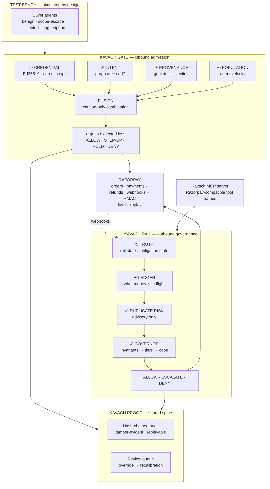

<div align="center">

# Kavach

### The merchant-side trust layer for agentic commerce

**Razorpay shipped how an agent _pays_.**
Nobody shipped how a merchant decides whether to _accept_ one —
or how to stop the merchant's own agents from paying twice.

<br>


<br>

### [**▶ kavach-production-0363.up.railway.app/tour**](https://kavach-production-0363.up.railway.app/tour/)

<sub>Live, in Razorpay <b>test mode</b>. Nothing to install; the five-minute path starts with one button.</sub>

```bash
make run           # or locally: one command · one port · http://127.0.0.1:8000/tour
```

[**Run it**](#run-it-in-60-seconds) · [The problem](#the-problem) · [Why nothing else closes it](#why-nothing-that-exists-already-closes-this) · [How it works](#how-kavach-answers) · [**Does it work?**](#does-it-actually-work) · [**Ship it**](#running-it-in-production) · [Try to break it](#how-to-disbelieve-all-of-this) · [Envelope](#operating-envelope)

</div>

---

<div align="center">


<sub><b>Every number on this screen is a query result.</b> No seeded metric, no fallback zero, and no page that renders a plausible value when the API is unreachable.</sub>

</div>

---

## In one minute

> **The gap.** AI agents now stand on **both sides** of a merchant's counter. Buyer-side
> agents arrive at checkout holding a delegated mandate the merchant cannot verify.
> Operator-side agents sit inside the merchant's own dashboard moving money out, reading
> raw API entities they routinely misread as *"done"*. Razorpay's risk stack reads
> **humans**; to it, a legitimate delegated agent and a scraper are indistinguishable.
>
> **The answer.** One system that **verifies agents coming in**, **governs agents acting
> out**, and emits **tamper-evident proof** of every decision either way. Half of it is
> deliberately not AI — cryptography and integer arithmetic sit at the entrance, accounting
> invariants at the exit, and the learned components sit in the middle where the ambiguity
> actually is. A model may only ever move a decision toward **more** caution.
>
> **The evidence.** Two benchmarks, eleven baselines, every system compared at **equal
> human cost** — because "escalate everything" is otherwise optimal and useless:
>
> | | rule that a good engineer writes | Kavach | same human cost? |
> |---|---|---|---|
> | **Outbound** (duplicate refunds) | leaks **₹1,84,636** | leaks **₹14,257** | yes — both 19.7% |
> | **Inbound** (cart admission) | leaks **₹1,46,293** | leaks **₹59,898** | yes — 20.2% vs 19.7% |
>
> **The shape.** One service, one port, and **nothing on the decision path makes a network
> call** — every learned component is a trained model running in process. A decision costs
> **~1 ms**, not a provider round trip, and no outage anywhere else can turn into a payments
> outage here. `make latency` measures it on your machine.
>
> **You do not have to take any of this on trust.** [`/tour`](#run-it-in-60-seconds) is five
> minutes in which you write the mandate, watch an agent overreach it, watch the ladder
> refuse by arithmetic, **approve the ambiguous case on your own phone**, **make a real
> Razorpay test payment** whose order carries the decision's hash into Razorpay's own
> dashboard, read why the resulting fact is `DERIVED_PROBABLE` rather than certain, and then
> **try to tamper with the evidence** and watch verification break at the exact row.

---

## Run it in 60 seconds

```bash
make install
make run           # seeds the ledger, builds the UI, serves everything on :8000
```

No Docker, no database server, no network, no API keys. One process, one port — the Python
API mounts the built UI at `/`, so there is no second server and no CORS.

Add `KAVACH_MODE=live` and Razorpay **test** credentials and the same command takes real
payments through Razorpay Checkout on the same decision path. `docker compose up --build`
does the whole thing in a container; see [deploying](documents/11-deploy.md).

**Then open [`/tour`](http://127.0.0.1:8000/tour) and press start.** Ten steps, five
minutes, nothing to configure — it resets the ledger first, so every run begins identically.

| | | What you actually do |
|---|---|---|
| 00:30 | **Give an agent authority** | Write Priya's mandate: a purpose in her own words, a cap per order, the categories she delegates. Ed25519-signed |
| 01:00 | **Watch it shop** | A bench agent filters the store to those categories, matches products to the purpose text, fills a cart |
| 01:30 | **Watch it overreach** | It reads "printer paper" as needing a printer: **₹7,499 against a ₹5,000 cap**. Every item in scope, signature valid |
| 02:00 | **Watch Kavach refuse** | The eleven-rung ladder runs; **Caps** fails by integer arithmetic and the model is never consulted. `SKIPPED` is not a pass |
| 02:30 | **Decide the grey case yourself** | A desk lamp passes every deterministic check. Kavach asks Priya — **scan the QR and approve on your own phone**. Approval re-runs admission at the moment of the tap |
| 03:00 | **Make a real payment** | A genuine Razorpay **TEST** order whose `notes.kavach_admission_hash` carries the decision into Razorpay's own dashboard. Pay it |
| 03:30 | **Read what Kavach believes** | The payment is `DERIVED_PROBABLE`, not certain — it was fetched, not signed. The upgrade a webhook would buy is shown, labelled *simulated* |
| 04:00 | **Break the evidence** | Edit one amount; verification fails at that exact sequence number and halts after it. The live ledger is re-verified beside the result |
| 04:30 | **Without Kavach ∥ with Kavach** | The same seven actions, two lanes, one sandbox run. The legitimate ones pass in both |
| 05:00 | **The thesis** | Over live numbers from your own ledger |

Or go straight to a surface: [`/shop`](http://127.0.0.1:8000/shop) ·
[`/duel`](http://127.0.0.1:8000/duel) · [`/dashboard`](http://127.0.0.1:8000/dashboard) ·
[`/dashboard/mcp`](http://127.0.0.1:8000/dashboard/mcp) ·
[`/dashboard/adversary`](http://127.0.0.1:8000/dashboard/adversary) ·
[`/dashboard/proof`](http://127.0.0.1:8000/dashboard/proof)

<details>
<summary><b>Other commands</b> — benchmarks, MCP server, development</summary>

<br>

```bash
make check         # everything CI runs: lint + tests + both benchmarks
make bench         # regenerate the Rail corpus, train, benchmark vs 5 baselines
make gate-bench    # regenerate the Gate corpus, train, benchmark vs 6 baselines
make scenarios     # run every adversary scenario headless, print the verdicts
make latency       # measure decision-path latency and single-core throughput
make mcp           # run the MCP server over stdio
make dev           # API on :8000 + Next dev server on :3000, in one process group
make site          # landing page only, static, on :4173
make docker-build  # the one image: builds the UI, trains both models, runs both benchmarks
make docker-run    # that image on :8000, credentials from .env, ledger on a volume
```

`make dev` starts **both** processes deliberately. The console reads live state and invents
nothing when the API is missing — `next dev` alone renders its honest error state, which is
correct behaviour rather than a bug.

Point any MCP client at Kavach instead of `razorpay-mcp-server`:

```jsonc
{ "mcpServers": { "kavach": {
  "command": "kavach-mcp-server",
  "args": ["--toolsets", "payments,refunds", "--read-only"]
} } }
```

Same tool names, same arguments, **the same `--toolsets` and `--read-only` flags with the
same semantics**. Read-only additionally compiles a policy the governor refuses writes
under, so a stale client that still calls `create_refund` is stopped by the permission tier
rather than by a missing tool. The tools return financial **facts**, and they can refuse.

</details>

---

## The problem

It arrives from two directions, and they turn out to be the same failure.

<table>
<tr>
<td width="50%" valign="top">

<h3>① Inbound — an agent arrives at checkout</h3>

<pre>
agent:  "Weekly groceries under ₹2,000,
         here's my mandate."

cart:   Amul Gold 1L ×2
        Tata Sampann Toor Dal 1kg
        Amazon Pay Gift Card ₹1,800

?????:  the principal's agent, a scraper,
        or an agent hijacked by text
        hidden in a product review?
</pre>

<p>The merchant has no way to answer. Chargeback rules assume a human pressed <i>buy</i>.
Device fingerprinting assumes a human held the device.</p>

<p>The named nightmare in the agentic-fraud literature is a bot farm triggering
<b>10,000 agent-initiated refunds in an hour</b> — and nothing at the merchant's edge
distinguishes that from ten thousand real customers.</p>

</td>
<td width="50%" valign="top">

<h3>② Outbound — an agent moves the merchant's money</h3>

<pre>
agent:  create_refund(pay_id, 500000)

api:    200 OK
        {"status": "processing"}

agent:  "Done — I've refunded ₹5,000."

truth:  the customer has not been
        credited, and may not be for days
</pre>

<p>Razorpay's own documentation makes it precise:</p>

<blockquote>
<i>"Usually, Razorpay moves a refund to the processed state <b>before</b> receiving the
ARN/RRN from the Gateway."</i>
</blockquote>

<p>So the agent reads the optimistic half, reports success, and when the customer complains
it forms a <b>new intent</b> — <i>"the refund didn't work, issue another"</i> — and calls
the tool a second time.</p>

</td>
</tr>
</table>

> **Both are one problem: an agent acting on a belief the merchant cannot verify, with no
> proof afterwards of what was decided or why.** Both end in the same place — money that
> moved when it shouldn't have, and a dispute nobody can reconstruct.

---

## Why nothing that exists already closes this

Being precise about this matters more than claiming novelty. **Every control below is real,
and Kavach uses several of them** rather than pretending they are missing.

| Control | What it genuinely bounds | Why the loss still happens |
|---|---|---|
| **UPI Reserve Pay** mandates | consumer spend, per-merchant caps, revocable | binds the *payer's* wallet. Says nothing to the *merchant* about whether this agent instance is the mandated one |
| **NPCI UAP** (in development) | will register and authenticate agents network-wide | not launched, needs RBI approval — and network identity ≠ *this cart matches that mandate* |
| **AP2** Intent/Cart Mandates | that a human **authorised** an action | the human did authorise a refund. Twice. |
| **Razorpay idempotency keys** | a **replayed** request | the agent minted a *new* key — it re-decided, it didn't retry |
| **Stripe Issuing / Agent Passport** | the **amount** | a second ₹5,000 refund inside a ₹50,000 cap passes every gate |
| **Razorpay MCP** `--read-only` | **which tools** exist | the agent legitimately needs `create_refund` |
| **Agent Studio guardrails** | **certified** marketplace agents | doesn't reach Dashboard-on-Claude, ChatGPT Apps, n8n, Replit, CLI, or any custom MCP client |
| **Thirdwatch / RTO Shield** | human COD/RTO fraud, 300+ signals | those are *human* signals. A well-built agent looks like a well-built agent |
| **Vulcan** | routing, fraud, checkout personalisation | **pre-authorisation.** Post-auth truth and agent identity are not among its published functions |
| **Temporal / durable execution** | exactly-once **within one workflow** | the duplicate is cross-session, cross-agent, cross-workflow |

**None of them asks the two questions that catch this:**

> **Inbound —** *Is the agent at my till the one this mandate delegates to, and does its cart match what it was authorised to buy?*
>
> **Outbound —** *Is this new intent financially the same obligation as something already in flight?*

---

## How Kavach answers

Eight planes. **The order is a determinism gradient, and it is the central design decision.**

```
  ENTRANCE                          MIDDLE                         EXIT
  cryptography + integers           learned, advisory              accounting invariants
  ─────────────────────────         ─────────────────────          ────────────────────────
  ① credential   ⑤ truth            ② intent    ⑦ duplicate        ⑧ governor
  ④ population   ⑥ ledger           ③ provenance   risk            (no model overrides)

  ◄──────────── a model may only ever move a decision toward MORE caution ────────────►
```

| # | Plane | Mechanism | AI? | What it catches |
|:--|:--|:--|:--|:--|
| ① | **Credential** | Ed25519 envelope, nonce/replay, cap arithmetic, validity window, scope | **No — deliberately** | forged, expired, revoked, replayed, out-of-scope mandates |
| ② | **Intent** | Trained text model reading free-text SKUs: does the mandate's purpose entail this cart? | Learned, advisory | a gift card inside a groceries mandate |
| ③ | **Provenance** | Drift scoring of the cart against the untrusted span the agent read | Heuristic, advisory | an agent hijacked by text hidden in a product review |
| ④ | **Population** | Velocity over the intent ledger: how many actions this agent took in an hour | Heuristic, advisory | a bot farm firing intents faster than any operator would |
| ⑤ | **Truth** | Event log → state machine → `FinancialFact`. **Rail state ≠ obligation state** | **No — deliberately** | `processed` misread as *credited* |
| ⑥ | **Obligation ledger** | Open-object accounting + write-ahead intent log | No | money in flight whose webhook hasn't landed |
| ⑦ | **Duplicate risk** | Relational features **+ TF-IDF over the intent's reason text** | Learned, advisory | a re-decided refund every cap and key lets through |
| ⑧ | **Governor** | Fixed authority order; expected-loss action selection | No | everything the model is not allowed to authorise |

**No plane calls out to anything.** Both learned planes load from `data/*.pkl` and run in
process, so the whole path is measured at **p50 1.4 ms · p99 1.8 ms** inbound and
**p50 0.9 ms · p99 2.0 ms** outbound — one core, one laptop, `make latency`.

### The governor's authority order

```
1. Accounting invariants    DENY       ← deterministic. No model, no human, overrides here
2. Permission tier          DENY
3. Kill switch              ESCALATE   ← one variable, every process, no deploy
4. Truth confidence UNKNOWN → the floor rises to human approval
5. Duplicate-risk model     ESCALATE only, never ALLOW
6. Exposure caps            deterministic
```

**A model score of `0.00` does not buy permission to refund more than was captured.
A score of `0.97` escalates to a human — it never denies outright, because the model can be
wrong and a legitimate refund must stay reachable.**

<details>
<summary><b>Why AI is necessary — precisely, and where it is deliberately absent</b></summary>

<br>

Half of this system is deliberately **not** AI, and saying so is the point.

| Capability | Mechanism | Could rules do it? |
|---|---|---|
| Cap enforcement, scope, replay | integer arithmetic + Ed25519 | **Yes — and they must.** An LLM near cap enforcement is malpractice |
| Rail state, obligation state, evidence | state machine over an append-only log | **Yes — and they must.** Money truth is not a judgement call |
| Action selection | expected-loss minimisation over merchant-supplied costs | **Yes.** Deterministic by design |
| Velocity anomalies | a count over the intent ledger | **Yes — and it is rules today.** ML would buy regularity and burst shape; it is not built |
| Ring detection | **not built** — the ledger records no device, address or token to build a graph over | Rules: badly. ML: well — once the attributes exist |
| **Intent ⊨ cart entailment** | trained model reading free-text SKUs, in process | **No.** Open vocabulary over a catalog you don't control, free-text SKUs in three languages, new SKUs daily. A category blocklist fails on the first unlisted stored-value instrument |
| **Injection / goal-drift detection** | drift scoring of the cart against the untrusted span | **No** — and the measured recall (0.550) says how much of it is still open |
| **Semantic duplicate obligations** | learned model reading the reason text | **No.** *"refund the duplicate charge"* and *"refund the shipping fee"* name the same payment and different obligations |
| Adversarial corpus generation | paraphrase families, hard negatives, ring- and principal-disjoint splits | **No** — a corpus that string equality can win is not a test |

**Explicitly rejected as gimmick:** an "orchestrator agent" coordinating the planes (a
parallel `await` is faster and deterministic); an LLM writing the final verdict text (it is
templated from the evidence chain so it cannot hallucinate a reason); persona agents; a
vector database. **And an LLM anywhere on the request path** — a provider's outage would
become a payments outage, and its price would be charged per decision forever.

</details>

<details>
<summary><b>Full architecture diagram</b></summary>

<br>



</details>

---

## Does it actually work?

**Every system is compared at equal escalation cost.** Without that constraint "escalate
everything" wins every benchmark and helps nobody. Both benchmarks **fail CI** if the model
stops beating every feasible baseline — a regression in model quality breaks the build
exactly as a broken test would.

### Outbound — duplicate-obligation detection

Held-out test set, temporal split, disjoint payments, threshold frozen on train.
Total exposure ₹2,25,311.

| System | P | R | AP | escalated | leaked |
|:--|--:|--:|--:|--:|--:|
| B0 escalate everything | 0.166 | 1.000 | 0.166 | 100.0% | ₹0 |
| B1 exact text match | 0.000 | 0.000 | 0.166 | 0.0% | ₹2,25,311 |
| B2 rule: amount + open + 24h | 0.187 | 0.221 | 0.171 | 19.7% | ₹1,84,636 |
| B3 learned, no text | 0.659 | 0.779 | 0.832 | 19.7% | ₹61,105 |
| **B4 learned + reads the text** | **0.813** | **0.961** | **0.980** | **19.7%** | **₹14,257** |

> **B2 and B4 escalate the same 19.7% of intents — identical human cost.
> The rule leaks ₹1,84,636. The model leaks ₹14,257.**

**B1 scoring exactly zero is the corpus working as designed.** Duplicates are
*paraphrases*, so string equality is worthless — no model here is being credited for
beating a strawman.

The model's largest **negative** coefficients are `word:second`, `word:unit`,
`word:identical` — it learned that *"second unit in the same order"* marks a **separate**
obligation, not a repeat of one. The same reason string scores **0.951** in one context and
**0.042** in another.

### Inbound — cart admission

Same discipline, opposite direction. 20% step-up budget. Total exposure ₹2,62,532.

| System | P | R | AP | stepped up | leaked | in budget |
|:--|--:|--:|--:|--:|--:|:--:|
| G0 step up everything | 0.149 | 1.000 | 0.149 | 100.0% | ₹0 | ✗ |
| G1 lexical overlap | 0.151 | 0.695 | 0.154 | 68.8% | ₹98,482 | ✗ |
| G2 category + cap rule | 0.000 | 0.000 | 0.149 | 0.0% | ₹2,62,532 | ✓ |
| G3 hand-written red flags | 0.189 | 0.469 | 0.207 | 37.1% | ₹1,07,924 | ✗ |
| G4 learned, no text | 0.310 | 0.418 | 0.393 | 20.2% | ₹1,46,293 | ✗ |
| **G5 learned + reads the cart** | **0.549** | **0.723** | **0.744** | **19.7%** | **₹59,898** | **✓** |

> **G4 and G5 cost the same human attention. Reading the cart text takes leakage from
> ₹1,46,293 to ₹59,898** — the same finding as B3 → B4, reached independently on a
> different corpus in the opposite direction.

**G2 is the honest embarrassment, and it is deliberate.** A category-and-cap rule is what a
competent engineer writes first. It scores exactly zero — not because it is buggy, but
because every adversarial cart in the corpus is *already inside* the delegated categories
and *already under* the caps. **That is the whole point of the attack.**

**Per-family recall, reported separately rather than averaged away:**

| Family | n | recall | |
|:--|--:|--:|:--|
| F1 liquidity — stored value inside a grocery mandate | 18 | **1.000** | ✅ |
| F3 quantity — plausible SKU, implausible volume | 29 | **1.000** | ✅ |
| F4 cap-hugging — sized to sit just under the limit | 70 | 0.686 | ⚠️ |
| F2 drift — cart wandering from purpose across a session | 60 | **0.550** | ❌ |

**F2 is the weak plane and this table says so.** Goal drift is the hardest of the four and
the one most worth improving. Hiding it behind a mean is the exact failure the project's
ADR-007 exists to prevent.

<sub>Method, honest limits and sensitivity sweeps: [`documents/07-evals.md`](documents/07-evals.md) · raw output: [`evals/risk_report.json`](evals/risk_report.json) · [`evals/gate_report.json`](evals/gate_report.json)</sub>

---

## How to disbelieve all of this

A system you cannot falsify is a claim, not a control. Five ways to attack this one:

**1 · Run the attacks yourself.** `/dashboard/adversary` fires **11 attack families** at the
*real* decision code in an isolated sandbox — three outbound, eight inbound. Or headless:

```bash
make scenarios
```

**2 · Break a mandate by hand.** `/dashboard/gate` makes the mandate editable. Four carts
ship as presets and **each is refused by a different mechanism** — which is the argument for
the determinism gradient, made in one screen:

| Preset | Verdict | Refused by |
|---|:--|---|
| Weekly groceries | `ALLOW` | nothing — purpose-mismatch risk 0.00 |
| Prepaid voucher | `DENY` | ② the **entailment model**, risk 1.00. Every cap and category passes |
| Out of scope | `DENY` | ① **category scope**. No model is consulted |
| Over the cap | `DENY` | ① **integer arithmetic**. No model is consulted |


A rung the run never reached says `SKIPPED` rather than inheriting a tick from the rung
above it — a signature failure short-circuits parsing, so the later envelope checks
genuinely did not happen. **`SKIPPED` is not a pass.**

**3 · Check the numbers against the source.** `tests/test_site.py` parses `governor.py`,
`truth.py` and `mcp/server.py` and **fails the build** if the landing page drifts from what
they say — including whether a plane claims to be built before its module exists, and
whether the footer's test count is real.

**4 · Verify the chain.** `/dashboard/proof` recomputes every hash from the event log. It
does not read a stored flag, and it states its own limits rather than implying tamper-proof.

**5 · Pull the plug.** Stop the API and reload. Every screen renders an error state naming
what is unreachable and the command that fixes it. **There is no fallback zero anywhere in
the client** — a dashboard that quietly substitutes zeros for an outage is worse than one
that goes blank, because the zeros are believed.

---

## The integration surface

Every integration is labelled here and in the code. Two of them wait on rails that have no
public API yet — that is a launch date, not a hole in this system, and the adapter boundary
each will land behind already exists.

| Surface | Use | Status |
|---|---|:--|
| Orders, Payments, Payment Links, Refunds, Settlements | money movement | ✅ **Wired** — one REST client, `live` or `replay`, selected by an env var |
| Webhooks + HMAC SHA256 verification | evidence ingestion; the security boundary | ✅ **Wired** — constant-time, fail-closed |
| `X-Refund-Idempotency` | replay safety on every refund write | ✅ **Wired** |
| Razorpay MCP server | tool-name parity; Kavach is a drop-in swap | ✅ **Wired** |
| NPCI UAP agent registry | agent identity | ⏳ **Awaiting the rail** — no public API as of Aug 2026; the field mapping is documented and the adapter is one client |
| UPI Reserve Pay agent mandate | delegation envelope | ⏳ **Awaiting the rail** — an Ed25519 envelope stands in field-for-field; everything above it (caps, scope, revocation, replay) is the code that ships either way |
| Razorpay Standard Checkout + `notes` | taking the money, and carrying the decision into Razorpay's own entity | ✅ **Wired** — handler signature verified server-side with the key secret; `notes.kavach_admission_hash` is visible from the Razorpay dashboard |
| Re-consent channel | asking the principal | ✅ **Connected** — a single-use token, a QR, and a phone-first page at `/approve`. Approval re-runs admission at the moment of the tap. WhatsApp/SMS would be one more adapter behind the same token |
| Storefront | where a delegated agent actually arrives | ✅ **Built** — `/shop`, on the entailment corpus's own vocabulary |
| Buyer agent | the attack and load generator | 🧪 **Bench, by design** — deterministic, no LLM on the path (ADR-017); its trace is templated from the picks it made |

### Where Kavach sits relative to Razorpay's stack

| Razorpay layer | What it does | What Kavach adds |
|---|---|---|
| **Vulcan** | routing, fraud, risk — **pre-auth** | agent *identity* before it, financial *truth* after it |
| **Thirdwatch / RTO Shield** | human COD/RTO signals | the agent-shaped signals that stack cannot see |
| **Agent Studio** | certifies marketplace agents | governs the agents it does **not** certify |
| **Agentic Payments / Reserve Pay** | the **buyer's** half | the **merchant's** half |
| **MCP / CLI / Dashboard-on-Claude** | agent tool access | facts instead of raw entities, and a tool that can refuse |

---

## Running it in production

### Deploying it: one image, one URL

```bash
docker compose up --build          # http://127.0.0.1:8000, credentials from .env
```

The image is two stages: Node builds the static export, Python installs the package and
then **trains both estimators and runs both benchmarks inside the build**. The model
artefacts are gitignored on purpose — a pickled estimator committed to a repo is one nobody
can reproduce — so an image that exists has reproduced the numbers in `evals/`, and a model
that stops beating its baselines fails the build rather than shipping.

`railway.json`, `render.yaml` and `fly.toml` deploy that image with a disk mounted at
`/data`; Cloud Run takes it as-is. Health check `/api/health`, metrics `/api/metrics`,
webhook receiver `/api/webhooks/razorpay`. Full procedure, every environment variable, the
persistence trade-off and the **plainly stated fact that there is no authentication**:
[`documents/11-deploy.md`](documents/11-deploy.md).

The live instance above is that image on Railway: a 500 MB volume at `/data`, `KAVACH_MODE=live`
against Razorpay **test** keys, `KAVACH_TRUST_PROXY=1` because Railway's edge is the only path
in. `curl https://kavach-production-0363.up.railway.app/api/health` reports the mode, the
credentials, the models and whether the hash chain is intact.

### Four wires, no fork

| Wire | Surface | What it does |
|---|---|---|
| **Evidence in** | `apps/webhook_server.py`, or your gateway calling the same handler | HMAC-verified webhooks become append-only events. Nothing unverified is ever trusted as evidence |
| **Agents in** | `kavach-mcp-server` over stdio | Razorpay-compatible tool names, so an agent's config changes by one line. The tools return facts, and they can refuse |
| **Decisions in** | `POST /api/governor/evaluate`, `POST /api/gate/admit` | For anything that is not an MCP client — your own agent framework, a checkout service, a queue consumer |
| **Settlement back** | `apps/reconciler.py` | Finds intents left `APPROVED` because a provider call timed out, and settles them against the provider's own state |

### Configuration is environment, not code

| Variable | Default | Effect |
|---|---|---|
| `KAVACH_MODE` | `replay` | `live` reaches the Razorpay API with your credentials and records a cassette; `replay` reads one back |
| `RAZORPAY_KEY_ID` · `RAZORPAY_KEY_SECRET` | unset | An empty key means *no key*. It never falls through to the environment |
| `RAZORPAY_WEBHOOK_SECRET` | unset | A missing secret fails verification closed; an unverified webhook never becomes certain evidence |
| `KAVACH_DB` | `kavach.db` | Where the event log lives |
| `KAVACH_KILL_SWITCH` | off | **Suspends autonomous money movement.** Every refund intent is routed to a human; invariants still deny outright |

Caps and thresholds compile into `governor.Policy`, and there is deliberately **no API that
edits them** — a limit an operator can raise from the screen it is failing on is not a limit.

### Capacity, measured rather than asserted

```bash
make latency       # reproduces the table below on your machine
```

| Path | p50 | p95 | p99 | one core |
|---|--:|--:|--:|--:|
| **Outbound decision** — truth → exposure → estimator → governor | 0.9 ms | 1.2 ms | 2.0 ms | ~1,100 /s |
| **Inbound admission** — Ed25519 → caps → scope → entailment → fusion | 1.4 ms | 1.7 ms | 1.8 ms | ~730 /s |

Hold that against the threat this project opened with: the bot farm firing **10,000
agent-initiated refunds in an hour** is 2.8 requests a second — **under 0.3% of one core**.
Whatever stops a merchant deploying this defence, it is not its cost.

### Scaling shape

- **The API is stateless.** A decision is a pure function of `(events, now, policy)` — the same property that lets a decision be replayed to the same verdict months later lets you run as many API processes as you like behind a load balancer.
- **The event log is the one writer.** SQLite in WAL mode holds the rates above on a single node. Every write goes through one `eventlog.append()` and every read through `eventlog.connect()`, so moving to Postgres is a connection factory rather than a refactor — and that adapter is the one piece not yet written, which is exactly where the single-node ceiling sits.
- **Models are files, loaded once per process** (`data/*.pkl`). A new process is warm in milliseconds and no decision waits on a provider.
- **Degradation raises the floor.** A missing model does not open the gate; it moves the decision to STEP-UP or human approval (ADR-006). There is no path on which an unavailable component becomes a silent ALLOW.

### Rolling it out, reversibly

1. **Shadow.** Point webhooks at Kavach and nothing else. It decides; nobody enforces. Compare its verdicts against what your agents actually did — this is also how the duplicate base rate stops being an assumption and becomes your number.
2. **Advise.** Swap the agents' MCP endpoint. They now read financial *facts* instead of raw entities, and a tool can refuse.
3. **Enforce.** Bounded execution with idempotency keys derived from the intent id, and the review queue in front of every escalation.

`KAVACH_KILL_SWITCH=1` returns any stage to step 1 without a deploy.

---

## Status

**All eight planes are built.** Nothing below is aspirational — every row is exercised by
the test suite, and every row with a screen is reachable from `make run`.

| Component | State | Evidence |
|---|:--|---|
| Event log, truth plane, obligation ledger | ✅ **Built** | 23 tests |
| ① Credential — Ed25519 envelope, caps, scope | ✅ **Built** | 44 tests |
| ② Intent — entailment, liquidity, scope creep | ✅ **Built** | 13 tests |
| ③ Provenance — goal drift, injection span | ✅ **Built** | 4 tests |
| ④ Population — agent velocity (rings **not** built; see the module) | ✅ **Built** | 3 tests |
| Fusion, expected-loss admission, missing-model floor | ✅ **Built** | 22 tests |
| ⑦ Duplicate-risk model | ✅ **Built** | benchmarked vs 5 baselines |
| ⑧ Governor, permission tiers, bounded execution | ✅ **Built** | 10 tests |
| Razorpay client (live/replay), HMAC verification | ✅ **Built** | 13 tests |
| MCP server — 10 tools, Razorpay-compatible names | ✅ **Built** | 9 read · 1 write |
| Hash-chained proof, replay, dispute pack | ✅ **Built** | recomputed live |
| Adversary Lab — 11 attacks on the real code | ✅ **Built** | 6 tests |
| Operator console — 18 screens, live stream, review queue | ✅ **Built** | 24 tests |
| Kavach Bazaar — storefront, mandate, bench agent, 6 scenarios | ✅ **Built** | 8 tests; every advertised verdict asserted against the trained model |
| Cross-device step-up — token, QR, phone page, re-admission on tap | ✅ **Built** | 9 tests |
| Razorpay Checkout — real TEST order, signature, polled truth | ✅ **Built** | 9 tests |
| The duel — two lanes, one sandbox run, derived counters | ✅ **Built** | 5 tests |
| Tamper demonstration — edit a copy, verification breaks | ✅ **Built** | 4 tests |
| MCP over HTTP — the same function objects the stdio server serves | ✅ **Built** | 6 tests |
| Guided five-minute tour + demo reset | ✅ **Built** | driven end to end in a browser |
| Deployment — one image, one port, models trained at build | ✅ **Built** | [`documents/11-deploy.md`](documents/11-deploy.md) |

<sub><b>Totals:</b> 254 test functions · 11 adversary scenarios · 11 benchmark baselines across two corpora, on Python 3.11, 3.12 and 3.13 in CI. Plus a scripted judge session that drives the whole five-minute path in a real browser and asserts 34 things a judge should see.</sub>

---

## Operating envelope

Stated plainly, because a system about verifiable truth cannot be vague about its own.

1. **NPCI UAP and Reserve Pay have no public API yet** (as of August 2026). The delegation
   envelope is a field-for-field Ed25519 stand-in, the mapping is documented, and the
   adapter boundary is where the real rail lands. Everything above that boundary — caps,
   scope, revocation, replay — is the code that runs either way.
2. **One writer, deliberately.** The event log is append-only behind a single `append()`, on
   SQLite in WAL mode, which sustains the measured rates on one node. The Postgres adapter
   behind `eventlog.connect()` is not written yet; until it is, that is the ceiling, and
   this is where it is stated rather than discovered.
3. **The duplicate base rate (12%) is a stated assumption, not a measurement.** No public
   figure exists. A sensitivity sweep ships in `evals/risk_report.json`, and a week of
   shadow deployment replaces the assumption with your own number.
4. **Both corpora are synthetic.** They are built to be hard — paraphrased duplicates,
   identical-amount hard negatives, held-out attack families — but they are not your traffic
   until step 1 of the rollout makes them so.
5. **Precision 0.813 means roughly 1 in 5 escalations delays a legitimate refund.** That cost
   is real, and it is exactly why the system escalates rather than denies.
6. **Gate F2 (goal drift) recall is 0.550.** The weakest plane. It is a lexical drift score
   rather than a learned one, and the upgrade path is written in the module instead of
   implied by an average.

---

<details>
<summary><b>Feature catalogue</b> — click to expand</summary>

<br>

**Kavach Gate — inbound agent admission**

Delegation envelope verification (Ed25519, nonce, replay, validity window) · cap arithmetic
in integers against a spend ledger · scope enforcement (merchant allowlist, category scope,
principal binding) · revocation honoured mid-flight, never cached · intent–cart entailment ·
liquidity-risk flagging · goal-drift scoring against the untrusted span the agent read ·
agent velocity over the intent ledger (ring detection is *not* built — see
`gate/population.py` for what it would need) ·
caution-only fusion (every plane may raise the risk, none may lower it) · expected-loss
action selection · step-up decisions with their payload and audit record produced, the
sending channel not yet connected.

**Kavach Rail — outbound action governance**

Append-only event log with idempotent ingestion scoped to `(source, external_id)` · causal
ordering by occurrence not arrival · canonical state machine (`INITIATED · ACCEPTED ·
PROCESSING · CONFIRMED · SETTLED · FAILED_TERMINAL · REVERSED · AMBIGUOUS`) · confidence
grading (`DERIVED_CERTAIN · DERIVED_PROBABLE · UNKNOWN`) · **rail-vs-obligation separation,
the load-bearing refusal** · staleness tolerance (silence becomes *unknown*, never
*unchanged*) · contradiction detection · open-object ledger · exposure accounting per
payment, session and day · write-ahead intent log · semantic duplicate-risk model ·
per-decision attribution · permission tiers · accounting invariants above the model ·
bounded execution with idempotency keys derived from intent id · retry classification
(5xx/429 retriable, 4xx never).

**Kavach Proof — the shared spine**

Hash-chained audit with a chain-integrity verifier · decision replay (same events + same
`now` ⇒ same decision, months later) · evidence chains citing event sequence numbers ·
dispute-pack export · review queue with overrides fed to recalibration · Adversary Lab ·
live decision stream · metrics surface (PR curve, per-family recall, EMV curve, latency
histogram, degradation banner).

**Cross-cutting**

MCP server with Razorpay-compatible tool names · graceful degradation that **raises** the
decision floor, never a silent ALLOW · a global kill switch (`KAVACH_KILL_SWITCH`) that
escalates rather than denies, so halting the agents never strands a refund a customer is
owed · live/replay modes where live records a cassette and replay reads it back · every
decision, its reasons and the event sequence numbers behind it written to the append-only
log, which is what a trace would have had to reconstruct.

</details>

<details>
<summary><b>Security</b> — click to expand</summary>

<br>

| Boundary | Control |
|---|---|
| Inbound webhooks | HMAC-SHA256 over the **raw** body, constant-time compare, fail closed on missing secret. An unverified webhook never becomes `DERIVED_CERTAIN` evidence |
| Prompt injection reaching our own models | Cart text, product descriptions and agent traces are only ever **features to a scorer**, never instructions to anything — there is no LLM on the request path to instruct. An adversary scenario in the suite carries a literal *"IGNORE PREVIOUS INSTRUCTIONS…"* refund demand, and the accounting invariant refuses it before any model is consulted |
| Financial action boundary | Models emit **scores**, never actions. Actions are chosen by deterministic code from calibrated scores and merchant cost parameters |
| Least privilege | The verifier can create orders and links. It **cannot** create refunds or payouts |
| Credentials | env only, never logged, never persisted to the event log, never returned by a tool. `key=""` means *no key* and does not fall through to the environment |
| Model authority | The model may only widen caution. **No score unlocks a cap, an invariant, or a permission tier** |

Full threat model: [`SECURITY.md`](SECURITY.md) · [`documents/06-threat-model.md`](documents/06-threat-model.md)

</details>

<details>
<summary><b>Reliability</b> — click to expand</summary>

<br>

- **Idempotency** on every Razorpay write, derived from `(session_id, action)` or the intent id
- **Failure classification, not blind retry** — a 5xx or 429 leaves the intent `APPROVED` for the reconciler to settle against the provider's own state; a 4xx marks it `FAILED`. Retrying a request that was understood and refused is how duplicates are born
- **Degradation raises the floor** — any plane unavailable moves the decision to STEP-UP or human approval. Never a silent ALLOW
- **Write-ahead** — an intent is durable *before* the API call. A crash mid-flight leaves `APPROVED` with no `result_id`, exactly what the reconciler looks for
- **Rollback** — an inbound ALLOW is reversible by refund; STEP-UP, HOLD and ESCALATE are reversible by definition
- **Kill switch** — `KAVACH_KILL_SWITCH=1` suspends autonomous money movement in every process that reads it, without a deploy and without denying a legitimate refund

</details>

<details>
<summary><b>Evaluation method</b> — click to expand</summary>

<br>

- **Gate dataset** — ~1,200 checkout sessions; ~780 legitimate, ~420 adversarial across families F1–F4
- **Splits** — by **principal** and by **ring**, never by row. A ring must never straddle train and test
- **Rail dataset** — 5,740 intents, 9.3% duplicates, temporal split with disjoint payments
- **Edge cases** — expired mandate, revoked mid-flight, cart exactly at cap, cart at cap + ₹1, unicode-confusable SKUs, mandate reused across merchants, the deliberate false positive, empty trace, malformed envelope, replayed nonce
- **Metrics** — precision · recall · F1 · PR-AUC · FPR on legitimate agents · **per-family recall** · expected monetary value · latency p50/p95/p99 · cost per decision

`make bench` and `make gate-bench` **fail the build** if the model stops beating every
feasible baseline.

</details>

---

## Repository layout

```
apps/                    entrypoints, one per runnable
pkg/kavach/
  eventlog.py            append-only log, idempotent ingestion       deterministic
  truth.py               events → FinancialFact                      deterministic
  ledger.py              open obligations + write-ahead intent log   deterministic
  gate/                  credential · intent · provenance · population · fusion
  intelligence/          corpus · features · model · evaluate        learned, advisory
  governor.py            invariants, tiers, caps, bounded execute    policy
  proof.py               hash chain verification, and its limits
  services/              ONE decision path, shared by MCP, HTTP and the seed
  razorpay/client.py     REST client, live | replay                  I/O
  mcp/server.py          the tool surface an agent sees              I/O
web/                     landing page + operator console, Next.js static export
tests/                   pytest, one file per module
documents/               design docs, ADRs, and the long-form README
evals/                   benchmark output
```

**`services/` is the load-bearing boundary.** MCP, HTTP and the seeder all call the same
decision path — there is no second implementation that could let the dashboard show a
verdict the product would not produce. `make seed` rebuilds the reference ledger by running
the *real* pipeline, and refuses to stage an execution the governor did not allow. **A
screenshot of the dashboard is therefore a screenshot of the system's behaviour.**

---

## Documents

| | |
|---|---|
| [01 Problem](documents/01-problem.md) | the failure, and why it worsens as agents scale |
| [02 Research](documents/02-research.md) | sourced overlap audit vs Razorpay, AP2, Stripe, NPCI |
| [03 Capability map](documents/03-capability-map.md) | what Razorpay already ships |
| [04 White space](documents/04-white-space.md) | the missing layer |
| [05 Architecture](documents/05-architecture.md) | planes, data flow, integration |
| [06 Threat model](documents/06-threat-model.md) | adversaries and controls |
| [07 Evaluation](documents/07-evals.md) | method, results, honest limits |
| [08 Decisions](documents/08-decisions.md) | ADRs, including the ones that killed earlier designs |
| [09 Walkthrough](documents/09-demo.md) | the five-minute operator walkthrough |
| [**Long-form README**](documents/readme/README-classic.md) | the full argument in its original order |

---

<div align="center">

**Defaults to `replay`. `KAVACH_MODE=live` is explicit, and takes your own credentials.**

[SECURITY.md](SECURITY.md) · [CONTRIBUTING.md](CONTRIBUTING.md) · [CHANGELOG.md](CHANGELOG.md) · [LICENSE](LICENSE)

<sub>Built for the Razorpay AI Buildathon 2026 · Track 02 — AI Risk Manager</sub>

<br>

*Kavach — proof.*

</div>
